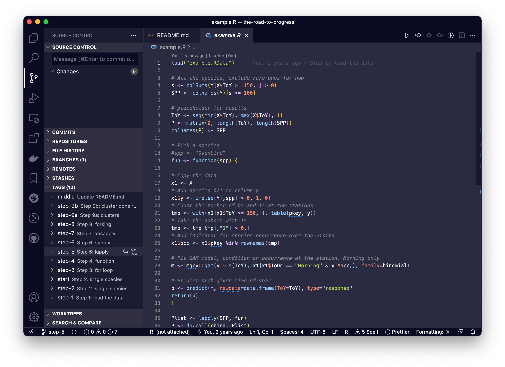
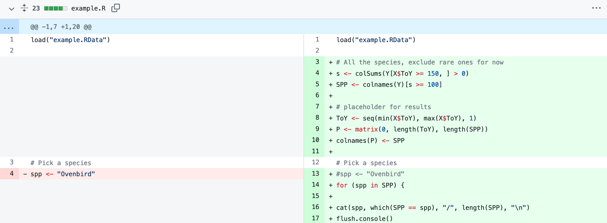
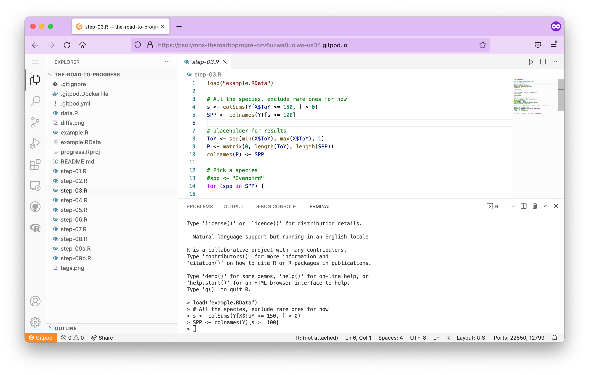

# The Road to Progress

> Step-by-step guide for vectorizing/parallelizing your R code

[](https://gitpod.io/#https://github.com/psolymos/the-road-to-progress)

You can best follow this tutorial the following way:
checkout the individual commits and look at the diffs.
This way you'll be able to observe how the code evolved.
The evolution shows the typical workflow.

<a href="http://www.youtube.com/watch?feature=player_embedded&v=uyhIiTTrTJY" target="_blank">
 
</a>

## What you'll need

``` R
install.packages(c("pbapply", "mgcv"))
```

## Steps

These steps demonstrate the usual workflow of how to interactively develop code and encapsulate it into a loop, then a function. This all sets us up for using vectorized functions that are well suited for parallel computing as well.

#### Locally with Git

Clone the repository: 

```bash 
git clone https://github.com/psolymos/the-road-to-progress.git
```

Open the repository as an R project in RStudio Desktop, VSCode, or R GUI.
Check out revisions using git tags to follow the steps:

- Step 1: `git checkout 45d5a67` or `git checkout step-1`
- Step 2: `git checkout 59eacb9` or `git checkout step-2`
- Step 3: `git checkout da685ae` or `git checkout step-3`
- Step 4: `git checkout 8321cdc` or `git checkout step-4`
- Step 5: `git checkout 9fc2c61` or `git checkout step-5`
- Step 6: `git checkout c0e1973` or `git checkout step-6`
- Step 7: `git checkout 370432f` or `git checkout step-7`
- Step 8: `git checkout 8ea4cd9` or `git checkout step-8`
- Step 9a: `git checkout b6c7729` or `git checkout step-9b`
- Step 9b: `git checkout db7c892` or `git checkout step-9b`

The `example.R` code will change along the steps, introducing new tricks.



#### Locally without Git

Download the zip file for this release: <https://github.com/psolymos/the-road-to-progress/releases/tag/start>.

Then follow along this commit history: <https://github.com/psolymos/the-road-to-progress/commits/master/example.R>.



#### In your browser with Gitpod

This link will open up a preinstalled Gitpod environment where you can run the scripts from each step by launching R and copy-pasting the contents from the `step-*.R` files.

[](https://gitpod.io/#https://github.com/psolymos/the-road-to-progress)



## Exercise

Check out Step 4 (`git checkout 8321cdc`) while creating a new branch from it: `git checkout -b <new-branch-name> 8321cdc`, or dowload this release: https://github.com/psolymos/the-road-to-progress/releases/tag/middle, then

1. Develop modular code by splitting the function into 2 pieces: (1) data processing + model training, and (2) prediction.
2. Use `lapply`/`sapply` to run the code in a vectorized fashion.
3. Adapt the vectorized format to show the progress and do it in parallel.

## Additional topics

- Promises: the [future API](https://cran.r-project.org/web/packages/future/index.html)
- [RNGs](https://cran.r-project.org/web/views/HighPerformanceComputing.html)
- [foreach](https://cran.r-project.org/web/packages/foreach/vignettes/foreach.html): `%do%` and `%dopar%`
- [purr](https://jennybc.github.io/purrr-tutorial/bk01_base-functions.html) & [map-reduce](https://burtmonroe.github.io/SoDA501/Materials/SplitApplyCombine_R/)
